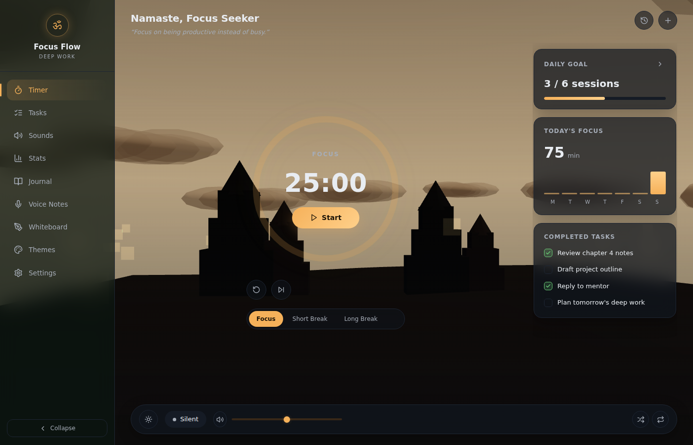
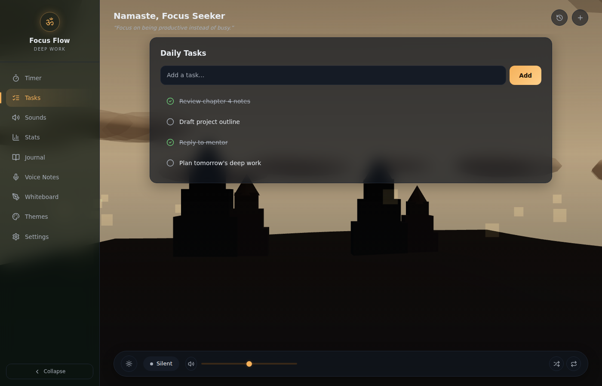
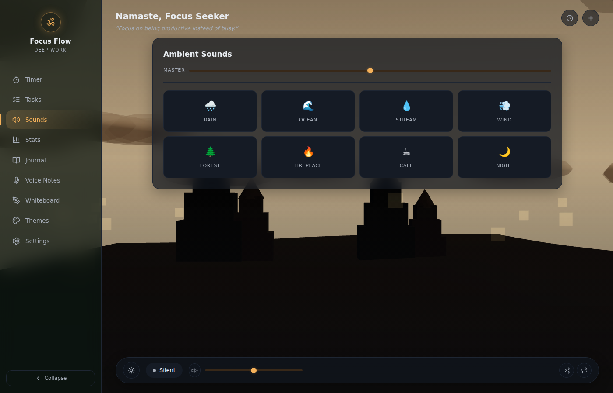
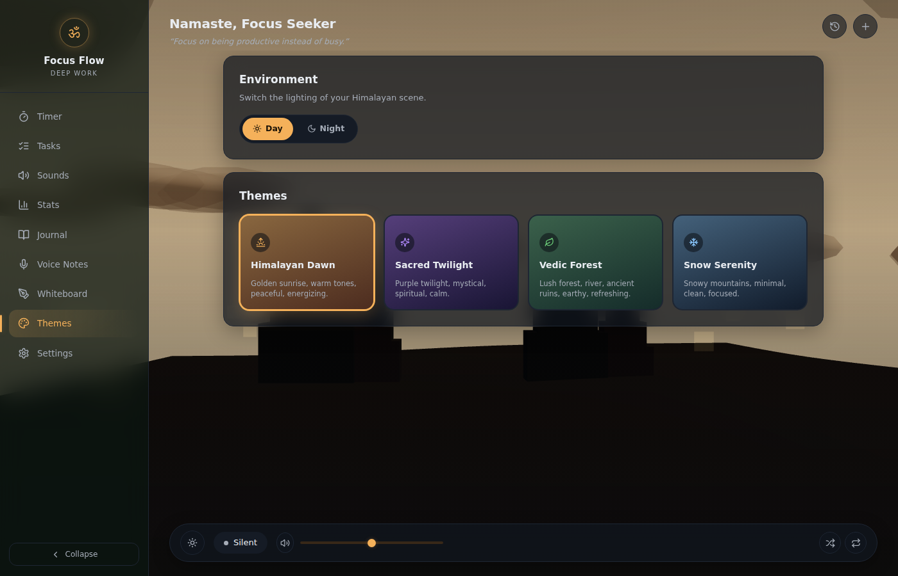
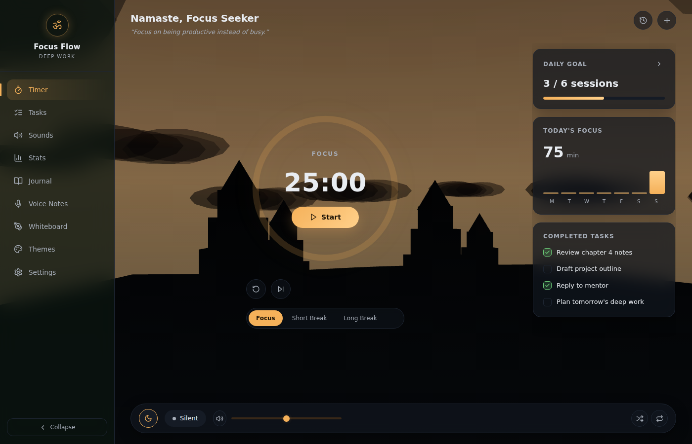
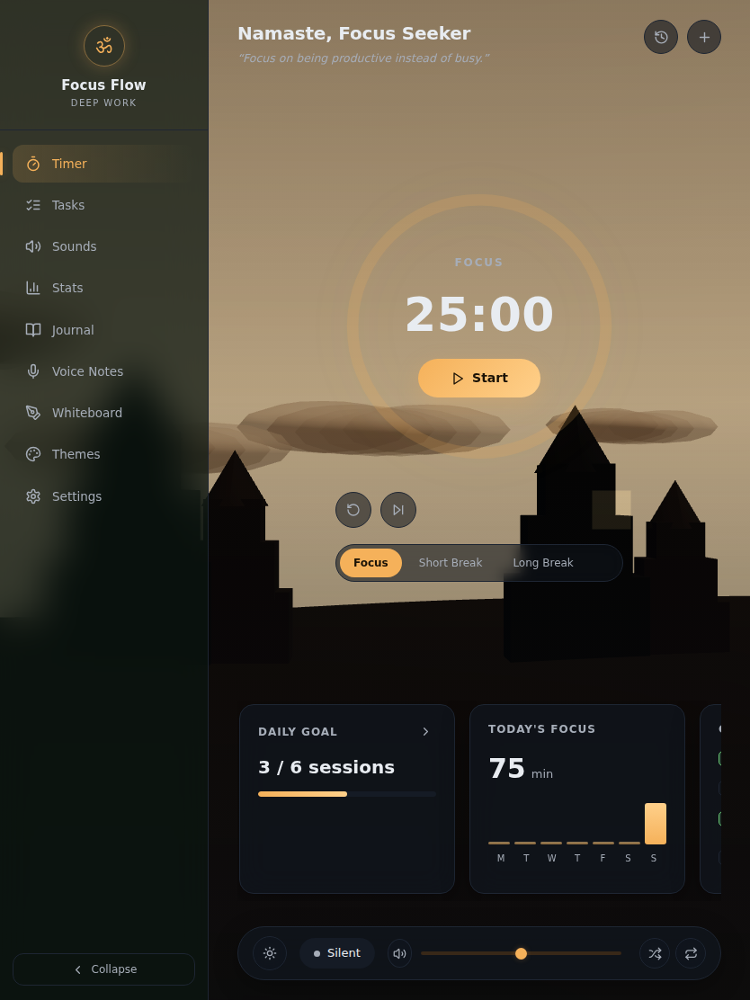
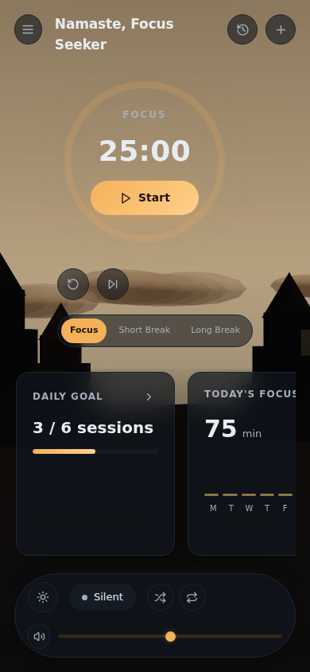

# Focus Flow

A cinematic, meditation-focused deep work environment inspired by Himalayan monasteries. Combines a Pomodoro timer with procedurally generated 3D landscapes, ambient soundscapes, and Vedic-inspired visual design.

**All data is stored locally on your device. Zero cloud sync, zero telemetry, zero network requests for persistence.**

---

## Screenshots

| Timer | Tasks |
|---|---|
|  |  |

| Sounds | Themes |
|---|---|
|  |  |

| Night mode | Tablet | Mobile |
|---|---|---|
|  |  |  |

---

## Features

- **Pomodoro Timer** — Focus/Short Break/Long Break with a circular gradient progress ring, start/pause/reset/skip controls, and automatic 4-session long-break cycling
- **Daily Goal, Today's Focus & Completed Tasks rail** — At-a-glance session progress, a 7-day focus minutes chart, and your task checklist without leaving the timer
- **4 Theme Environments** — Himalayan Dawn, Sacred Twilight, Vedic Forest, Snow Serenity — each with a distinct accent color and 3D scene palette
- **Day / Night Mode** — Independent lighting toggle that dims the sky, terrain and mist and brings out the stars
- **Procedural 3D Scene** — Terrain, temple silhouettes, clouds, mist, and starfield using Three.js
- **8 Ambient Sounds** — Rain, Ocean, Stream, Wind, Forest, Fireplace, Cafe, Night — synthetically generated via Web Audio API (no audio files needed), with a persistent mini-player in the bottom bar
- **Task Management** — Add, complete, and delete tasks with localStorage persistence
- **Session Tracking** — Automatic session logging with a dedicated stats view
- **Fully Offline** — Works completely offline after the initial page load
- **Local-First** — All data persisted to `localStorage`. No external databases, no cloud sync, no API calls.
- **Responsive** — Desktop, tablet and mobile layouts, including a collapsible sidebar and an off-canvas mobile nav drawer

---

## Tech Stack

| Layer | Technology |
|-------|-----------|
| Framework | [Next.js 16](https://nextjs.org/) (App Router) |
| Language | TypeScript |
| Styling | Tailwind CSS v4 |
| 3D Rendering | Three.js + @react-three/fiber + @react-three/drei |
| Audio | Web Audio API (procedural synthesis) |
| Animation | Framer Motion |
| Icons | Lucide React |
| Fonts | Inter (via next/font) |
| Testing | Vitest + Testing Library |
| Build | Next.js standalone output |

---

## Local-First Architecture

FocusFlow is built on a strict **local-first** principle:

```
┌─────────────────────────────────────┐
│           Browser (Client)          │
│                                     │
│  ┌─────────┐    ┌────────────────┐  │
│  │   UI     │◄──►│  React Hooks   │  │
│  │ (page.tsx)│    │ (useTimer,     │  │
│  └─────────┘    │  useTasks,      │  │
│                 │  useSessions,   │  │
│  ┌─────────┐    │  useAudio)      │  │
│  │  Scene3D │    └───────┬────────┘  │
│  │ (Three)  │            │           │
│  └─────────┘            ▼           │
│                 ┌────────────────┐  │
│                 │  localStorage  │  │
│                 │  Provider      │  │
│                 └───────┬────────┘  │
│                         ▼           │
│                 ┌────────────────┐  │
│                 │  Browser       │  │
│                 │  localStorage  │  │
│                 └────────────────┘  │
└─────────────────────────────────────┘
```

- **Zero server-side persistence** — No backend database, no REST API, no GraphQL
- **Zero third-party storage** — No Firebase, Supabase, or cloud services
- **Zero analytics** — No telemetry, tracking pixels, or analytics SDKs
- **Zero external audio** — All sounds are procedurally generated; no audio files to download
- **Zero runtime network calls** — After the initial page load, the app makes zero `fetch`/`XMLHttpRequest`/`WebSocket` calls

All state is persisted via `window.localStorage` through a thin abstraction layer (`src/lib/storage/`) that handles JSON serialization and SSR safety.

### Storage Keys

| Key | Contents |
|-----|----------|
| `focusflow_theme` | Current theme ID |
| `focusflow_day_night` | Day or night lighting mode |
| `focusflow_timer` | Timer state (remaining, mode, running) |
| `focusflow_tasks` | Task list |
| `focusflow_sessions` | Completed sessions |
| `focusflow_sounds` | Sound state and volumes |
| `focusflow_daily_goal` | Daily session goal |

---

## Installation

### Prerequisites

- Node.js >= 18
- npm, yarn, pnpm, or bun

### Quick Start

```bash
# Clone the repository
git clone https://github.com/your-username/focusflow.git
cd focusflow/frontend

# Install dependencies
npm install

# Start development server
npm run dev

# Open http://localhost:3000
```

### Production Build

```bash
npm run build
npm run start
```

### Docker

```bash
docker compose up --build -d
# App available at http://localhost:3001
```

---

## Usage

1. **Timer** — Select Focus, Short Break, or Long Break mode. Press Start. The ring fills as time progresses; use the small icon buttons to reset or skip. Every 4th completed focus session automatically rolls into a Long Break.
2. **Tasks** — Switch to the Tasks view (or the `+` icon in the top bar), type a task, and press Enter or click Add. Completed tasks also show in the Timer view's "Completed Tasks" card.
3. **Sounds** — Switch to the Sounds view, click any sound card to play, and use its slider for per-sound volume. The bottom bar always shows a mini player with master volume, shuffle (plays a random sound) and stop-all controls.
4. **Themes** — Open the Themes view to pick from 4 environments (Himalayan Dawn, Sacred Twilight, Vedic Forest, Snow Serenity) and toggle Day/Night lighting.
5. **Stats** — View today's session count, total focus time, and recent session history.
6. **Settings** — Adjust master volume, cycle your daily session goal, or clear all local data.

---

## Development

### Scripts

| Script | Description |
|--------|-------------|
| `npm run dev` | Start development server |
| `npm run build` | Production build |
| `npm run start` | Start production server |
| `npm run test` | Run test suite |
| `npm run test:watch` | Run tests in watch mode |
| `npm run lint` | Run ESLint |

### Project Structure

```
frontend/
├── docs/screenshots/         # README screenshots
├── src/
│   ├── app/
│   │   ├── globals.css       # Design tokens, layout classes, responsive breakpoints
│   │   ├── layout.tsx        # Root layout with ThemeProvider
│   │   ├── page.tsx          # Client-only loader (next/dynamic, ssr:false) for AppShell
│   │   └── page.test.tsx     # Page integration tests
│   ├── components/
│   │   ├── AppShell.tsx      # Composes layout + views; all app state lives here
│   │   ├── Scene3D.tsx       # Three.js procedural 3D scene (day/night aware)
│   │   ├── ThemeContext.tsx  # Theme + day/night provider with CSS variable injection
│   │   ├── layout/
│   │   │   ├── Sidebar.tsx   # Nav rail (Timer/Tasks/Sounds/Stats/Themes/Settings)
│   │   │   ├── TopBar.tsx    # Greeting, rotating quote, history/quick-add actions
│   │   │   └── BottomBar.tsx # Persistent ambient sound mini-player
│   │   ├── timer/
│   │   │   └── TimerDial.tsx # Circular gradient progress ring + controls
│   │   ├── rail/
│   │   │   └── RightRail.tsx # Daily Goal / Today's Focus / Completed Tasks cards
│   │   └── views/             # Tasks, Sounds, Stats, Themes, Settings full-page views
│   └── lib/
│       ├── constants.ts      # Shared constants (durations)
│       ├── tokens.ts         # Fixed design tokens (color/radius/space)
│       ├── themes.ts         # Theme color + scene definitions
│       ├── color.ts          # Color helpers (night-mode darkening)
│       ├── audio-engine.ts   # Web Audio API procedural sound engine
│       ├── storage/
│       │   ├── types.ts      # TypeScript types for all state
│       │   ├── provider.ts   # Storage provider interface
│       │   └── local.ts      # localStorage implementation
│       └── hooks/
│           ├── useTimer.ts     # Pomodoro timer logic
│           ├── useTasks.ts     # Task CRUD operations
│           ├── useSessions.ts  # Session history tracking
│           ├── useAudio.ts     # Sound state management
│           └── useDailyGoal.ts # Daily session goal
├── vitest.config.ts
└── package.json
```

### Testing

```bash
# Run all tests
npm run test

# Run tests in watch mode
npm run test:watch
```

Tests cover:
- Timer logic (start, pause, reset, completion, mode switching)
- State persistence (localStorage save/restore, corruption handling)
- Storage provider (CRUD, error handling, SSR safety)
- Theme definitions (structure, completeness, uniqueness)
- Constants validation
- UI component rendering
- Network call verification (ensures zero network requests)

---

## Architecture Decisions

### Why localStorage instead of IndexedDB?
localStorage is simpler, synchronous (no async complexity for small data), and sufficient for the app's data volume (< 1MB total). If the task list grows large, migration to IndexedDB would be straightforward via the storage provider abstraction.

### Why procedural audio instead of audio files?
Procedural synthesis via Web Audio API means zero audio file downloads, zero server bandwidth for audio, and a smaller bundle size. The app works fully offline without any audio assets.

### Why single-page architecture?
The app is a focused productivity tool with a single workflow. A single-page architecture eliminates navigation overhead, simplifies state management, and keeps the bundle small.

### Why is the app shell loaded client-only (`next/dynamic`, `ssr: false`)?
Every piece of app state (theme, timer, tasks, sessions, sounds, daily goal) is seeded from `localStorage`, which doesn't exist during server rendering. Reading it via a `useState` lazy initializer makes state correct from the first client render, but since `AppShell` is otherwise part of the statically prerendered HTML, that first client render (hydration) would immediately diverge from the empty-state HTML the server sent — producing a React hydration-mismatch error (`#418`) as soon as a real user (who has saved data) loads the page. Loading `AppShell` through `next/dynamic(..., { ssr: false })` in `page.tsx` (the same pattern already used for `Scene3D`, which depends on browser-only WebGL APIs) removes it from server rendering entirely, so there's nothing for the client to mismatch against — the shell mounts once, client-side, already showing the real persisted state. There's no SEO/content-indexing downside here since the app has no public content to crawl.

---

## License

MIT — see [LICENSE](./LICENSE) for details.
