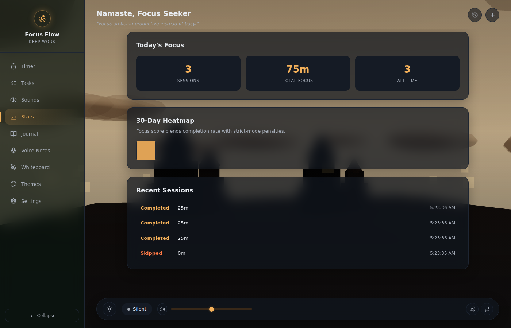
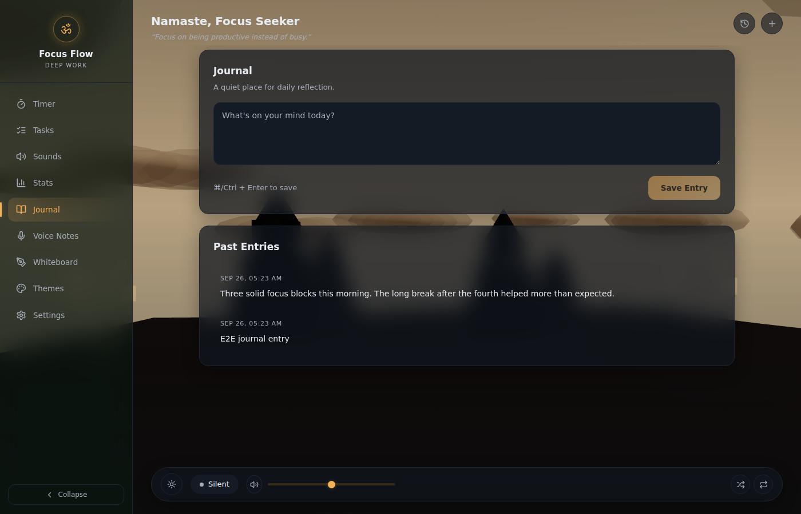
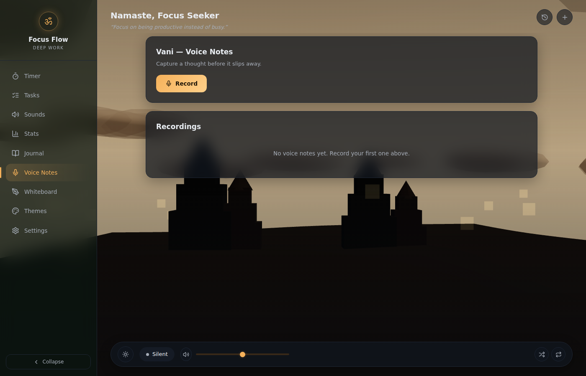
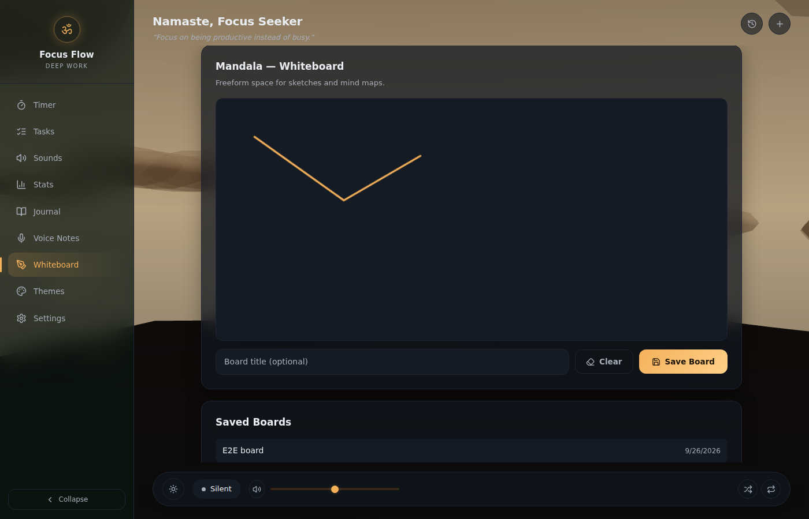

# Focus Flow

A cinematic, meditation-focused deep work environment inspired by Himalayan monasteries. Combines a Pomodoro timer with procedurally generated 3D landscapes, ambient soundscapes, and Vedic-inspired visual design — backed by the [FocusFlow FastAPI service](../backend) for tasks, sessions, journaling, voice notes and whiteboards.

**No accounts, no cloud sync, no telemetry.** The frontend is a pure client — every request goes straight from your browser to the backend you run yourself (see [Local-First, Self-Hosted](#local-first-self-hosted-architecture) below for exactly what is and isn't sent over the network).

---

## Screenshots

| Timer | Tasks |
|---|---|
|  |  |

| Stats | Sounds |
|---|---|
|  |  |

| Journal | Voice Notes | Whiteboard |
|---|---|---|
|  |  |  |

| Themes | Night mode |
|---|---|
|  |  |

| Tablet | Mobile |
|---|---|
|  |  |

---

## Features

- **Pomodoro Timer** — Focus/Short Break/Long Break with a circular gradient progress ring, start/pause/reset/skip controls, and automatic 4-session long-break cycling. Skipping mid-focus logs the attempt as a failed session; letting it run out logs it as completed.
- **Daily Goal, Today's Focus & Completed Tasks rail** — At-a-glance session progress, a 7-day focus minutes chart, and your task checklist without leaving the timer
- **Tasks** — Add, complete, and delete tasks, backed by the FastAPI `/tasks` endpoints
- **Stats** — Today's session count and focus minutes, a 30-day focus-score heatmap, and recent session history, all sourced from the backend
- **Journal** — Timestamped reflection entries (`/journal`)
- **Vani (Voice Notes)** — Record from the browser microphone and play back past recordings (`/voice-notes`)
- **Mandala (Whiteboard)** — Freeform canvas sketching with save/load (`/whiteboards`)
- **4 Theme Environments** — Himalayan Dawn, Sacred Twilight, Vedic Forest, Snow Serenity — each with a distinct accent color and 3D scene palette
- **Day / Night Mode** — Independent lighting toggle that dims the sky, terrain and mist and brings out the stars
- **Procedural 3D Scene** — Terrain, temple silhouettes, clouds, mist, and starfield using Three.js
- **8 Ambient Sounds** — Rain, Ocean, Stream, Wind, Forest, Fireplace, Cafe, Night — synthetically generated locally via Web Audio API (no audio files, no network request), with a persistent mini-player in the bottom bar
- **Responsive** — Desktop, tablet and mobile layouts, including a collapsible sidebar and an off-canvas mobile nav drawer

---

## Tech Stack

| Layer | Technology |
|-------|-----------|
| Framework | [Next.js 16](https://nextjs.org/) (App Router) |
| Language | TypeScript |
| Styling | Tailwind CSS v4 |
| 3D Rendering | Three.js + @react-three/fiber + @react-three/drei |
| Audio | Web Audio API (procedural synthesis) |
| Data fetching | Native `fetch`, thin typed client (`src/lib/api/`) — no external HTTP library |
| Animation | Framer Motion |
| Icons | Lucide React |
| Fonts | Inter (via next/font) |
| Testing | Vitest + Testing Library |
| Build | Next.js standalone output |

---

## Local-First, Self-Hosted Architecture

FocusFlow has no third-party backend of any kind. Everything either stays in your browser or goes straight to the [FastAPI service](../backend) you run yourself — never to a cloud service the project doesn't control.

```
┌───────────────────────────────┐        ┌──────────────────────────┐
│         Browser (Client)      │        │   Your FastAPI backend   │
│                               │        │   (localhost:8000 by      │
│  ┌─────────┐  ┌────────────┐  │  fetch │    default)               │
│  │   UI     │◄►│ React Hooks │─┼───────►│  tasks · sessions ·       │
│  │(AppShell)│  │(useTasks,   │  │        │  journal · voice notes ·  │
│  └─────────┘  │ useSessions,│  │        │  whiteboards · analytics  │
│               │ useJournal, │  │        │           │               │
│  ┌─────────┐  │ ...)        │  │        │           ▼               │
│  │  Scene3D │  └──────┬──────┘  │        │      PostgreSQL          │
│  │ (Three)  │         │         │        └──────────────────────────┘
│  └─────────┘         ▼         │
│               ┌────────────┐   │
│               │localStorage│   │
│               │(theme, day/│   │
│               │night, timer│   │
│               │ ticking,   │   │
│               │ sounds,    │   │
│               │ daily goal)│   │
│               └────────────┘   │
└───────────────────────────────┘
```

- **What goes to the backend**: tasks, sessions, journal entries, voice note recordings, and whiteboards — all via plain `fetch` calls to the URL in `NEXT_PUBLIC_API_URL` (defaults to `http://localhost:8000`). No third-party API is ever involved.
- **What stays purely local**: theme choice, day/night mode, the ticking timer's in-progress state, ambient sound settings, and the daily session goal. None of this needs a server round-trip, so it's kept in `localStorage` for instant reads/writes.
- **Zero third-party storage** — No Firebase, Supabase, or cloud services of any kind
- **Zero analytics** — No telemetry, tracking pixels, or analytics SDKs
- **Zero external audio** — Ambient sounds are procedurally generated; no audio files to download
- **One-time migration** — Earlier builds kept tasks and sessions in `localStorage`. On first load after upgrading, `src/lib/migrateLocalData.ts` pushes anything still sitting there up to the backend once, then stops touching those keys.

### Storage Keys (local-only state)

| Key | Contents |
|-----|----------|
| `focusflow_theme` | Current theme ID |
| `focusflow_day_night` | Day or night lighting mode |
| `focusflow_timer` | Timer state (remaining, mode, running) |
| `focusflow_sounds` | Sound state and volumes |
| `focusflow_daily_goal` | Daily session goal |
| `focusflow_migrated_v1` | One-time flag marking the local→backend migration as done |

### Backend Data (via `/tasks`, `/sessions`, `/journal`, `/voice-notes`, `/whiteboards`)

Tasks, sessions, journal entries, voice notes, and whiteboards are fetched from and written to the FastAPI + PostgreSQL backend — see the root [`README.md`](../README.md) for the API reference and setup.

---

## Installation

### Prerequisites

- Node.js >= 18
- npm, yarn, pnpm, or bun
- The [FocusFlow backend](../backend) running and reachable (defaults to `http://localhost:8000`) — Tasks, Sessions, Journal, Voice Notes and Whiteboards all need it. Theme, timer ticking, ambient sounds, and the daily goal work without it.

### Quick Start

```bash
# Clone the repository
git clone https://github.com/your-username/focusflow.git
cd focusflow/frontend

# Install dependencies
npm install

# Point the app at your backend (defaults to http://localhost:8000 if omitted)
cp .env.example .env.local

# Start development server
npm run dev

# Open http://localhost:3000
```

### Production Build

```bash
npm run build
npm run start
```

### Docker

```bash
docker compose up --build -d
# App available at http://localhost:3001
```

---

## Usage

1. **Timer** — Select Focus, Short Break, or Long Break mode. Press Start. The ring fills as time progresses; use the small icon buttons to reset or skip. Every 4th completed focus session automatically rolls into a Long Break. Letting a focus session run out logs it to the backend as `completed`; skipping out of one mid-way logs it as `failed`.
2. **Tasks** — Switch to the Tasks view (or the `+` icon in the top bar), type a task, and press Enter or click Add. Completed tasks also show in the Timer view's "Completed Tasks" card. Backed by the `/tasks` API.
3. **Sounds** — Switch to the Sounds view, click any sound card to play, and use its slider for per-sound volume. The bottom bar always shows a mini player with master volume, shuffle (plays a random sound) and stop-all controls. Fully local — no backend involved.
4. **Stats** — View today's session count, total focus minutes, a 30-day focus-score heatmap, and recent session history — all from the backend's `/sessions` and `/analytics/heatmap`.
5. **Journal** — Write a reflection and save it (`⌘`/`Ctrl` + `Enter`), or browse past entries.
6. **Voice Notes (Vani)** — Click Record, grant microphone access, click Stop — the recording uploads automatically and appears in the list with playback controls.
7. **Whiteboard (Mandala)** — Draw freeform with mouse or touch, optionally name the board, and Save. Click any saved board in the list to load it back onto the canvas.
8. **Themes** — Open the Themes view to pick from 4 environments (Himalayan Dawn, Sacred Twilight, Vedic Forest, Snow Serenity) and toggle Day/Night lighting.
9. **Settings** — Adjust master volume, cycle your daily session goal, or clear locally-stored preferences (theme, day/night, volume, goal). This does not delete anything from the backend.

---

## Development

### Scripts

| Script | Description |
|--------|-------------|
| `npm run dev` | Start development server |
| `npm run build` | Production build |
| `npm run start` | Start production server |
| `npm run test` | Run test suite |
| `npm run test:watch` | Run tests in watch mode |
| `npm run lint` | Run ESLint |

### Project Structure

```
frontend/
├── docs/screenshots/         # README screenshots
├── .env.example              # NEXT_PUBLIC_API_URL
├── src/
│   ├── app/
│   │   ├── globals.css       # Design tokens, layout classes, responsive breakpoints
│   │   ├── layout.tsx        # Root layout with ThemeProvider
│   │   ├── page.tsx          # Client-only loader (next/dynamic, ssr:false) for AppShell
│   │   └── page.test.tsx     # Page integration tests
│   ├── components/
│   │   ├── AppShell.tsx      # Composes layout + views; all app state lives here
│   │   ├── Scene3D.tsx       # Three.js procedural 3D scene (day/night aware)
│   │   ├── ThemeContext.tsx  # Theme + day/night provider with CSS variable injection
│   │   ├── layout/
│   │   │   ├── Sidebar.tsx   # Nav rail (Timer/Tasks/Sounds/Stats/Journal/Voice Notes/Whiteboard/Themes/Settings)
│   │   │   ├── TopBar.tsx    # Greeting, rotating quote, history/quick-add actions
│   │   │   └── BottomBar.tsx # Persistent ambient sound mini-player
│   │   ├── timer/
│   │   │   └── TimerDial.tsx # Circular gradient progress ring + controls
│   │   ├── rail/
│   │   │   └── RightRail.tsx # Daily Goal / Today's Focus / Completed Tasks cards
│   │   └── views/             # Tasks, Sounds, Stats, Journal, VoiceNotes, Whiteboard, Themes, Settings
│   └── lib/
│       ├── constants.ts      # Shared constants (durations)
│       ├── tokens.ts         # Fixed design tokens (color/radius/space)
│       ├── themes.ts         # Theme color + scene definitions
│       ├── color.ts          # Color helpers (night-mode darkening)
│       ├── random.ts         # Deterministic pseudo-random (keeps Scene3D generators pure)
│       ├── audio-engine.ts   # Web Audio API procedural sound engine
│       ├── migrateLocalData.ts # One-time localStorage → backend upgrade path
│       ├── api/
│       │   ├── client.ts     # fetch wrapper (base URL, JSON/FormData, error handling)
│       │   ├── types.ts      # Wire types matching the backend's Pydantic models
│       │   └── endpoints.ts  # Typed functions per resource (tasksApi, sessionsApi, ...)
│       ├── storage/
│       │   ├── types.ts      # TypeScript types for all state
│       │   ├── provider.ts   # Storage provider interface
│       │   └── local.ts      # localStorage implementation
│       └── hooks/
│           ├── useTimer.ts      # Pomodoro timer logic (local only)
│           ├── useTasks.ts      # Task CRUD against the backend, optimistic updates
│           ├── useSessions.ts   # Session history against the backend
│           ├── useJournal.ts    # Journal entries against the backend
│           ├── useVoiceNotes.ts # Voice note upload/list against the backend
│           ├── useWhiteboards.ts # Whiteboard save/list against the backend
│           ├── useHeatmap.ts    # 30-day focus heatmap from the backend
│           ├── useAudio.ts      # Sound state management (local only)
│           └── useDailyGoal.ts  # Daily session goal (local only)
├── vitest.config.ts
└── package.json
```

### Testing

```bash
# Run all tests
npm run test

# Run tests in watch mode
npm run test:watch
```

Tests cover:
- Timer logic (start, pause, reset, completion, mode switching) — confirmed to make zero network calls, since it's local-only by design
- Task and session hooks against a mocked `fetch`: load, optimistic add/toggle/delete with rollback on failure, error surfacing, and `reload()`
- State persistence (localStorage save/restore, corruption handling) for the remaining local-only state
- Storage provider (CRUD, error handling, SSR safety)
- Theme definitions (structure, completeness, uniqueness)
- Constants validation
- Page-level integration: all nine nav views render and are reachable, right-rail summary cards, greeting/quote

---

## Architecture Decisions

### Why localStorage instead of IndexedDB for the remaining local-only state?
Theme, day/night mode, in-progress timer state, ambient sound settings, and the daily goal are small and read/written synchronously on every interaction. localStorage is simpler than IndexedDB for that access pattern and sufficient for the data volume involved (well under 1MB).

### Why does the timer stay client-side instead of syncing to the backend's `/state` endpoint every second?
The backend exposes `GET`/`POST /state` for a single global timer, but ticking it over the network every second would mean a request per second per open tab, extra latency on every tick, and no real benefit — nothing else needs to observe the timer mid-countdown. The timer stays entirely client-side (`useTimer`, `localStorage`-backed) and only talks to the backend at the moments that matter: when a focus session completes or is abandoned, it's logged once via `POST /sessions`.

### Why procedural audio instead of audio files?
Procedural synthesis via Web Audio API means zero audio file downloads, zero server bandwidth for audio, and a smaller bundle size. The app works fully offline without any audio assets.

### Why single-page architecture?
The app is a focused productivity tool with a single workflow. A single-page architecture eliminates navigation overhead, simplifies state management, and keeps the bundle small.

### Why is the app shell loaded client-only (`next/dynamic`, `ssr: false`)?
Theme, day/night mode, timer state, sound settings, and the daily goal are seeded from `localStorage` via `useState` lazy initializers, which makes state correct from the very first client render — but `localStorage` doesn't exist during server rendering, and `AppShell` is otherwise part of the statically prerendered HTML. That first client render (hydration) would immediately diverge from the empty-state HTML the server sent, producing a React hydration-mismatch error (`#418`) as soon as a real user (who has saved data) loads the page. (Tasks/sessions/journal/voice-notes/whiteboards don't have this problem on their own — they start empty and populate via a normal `useEffect` fetch after mount — but they live in the same component tree.) Loading `AppShell` through `next/dynamic(..., { ssr: false })` in `page.tsx` (the same pattern already used for `Scene3D`, which depends on browser-only WebGL APIs) removes the whole shell from server rendering, so there's nothing for the client to mismatch against — it mounts once, client-side, already showing the real persisted state. There's no SEO/content-indexing downside here since the app has no public content to crawl.

---

## License

MIT — see [LICENSE](./LICENSE) for details.
